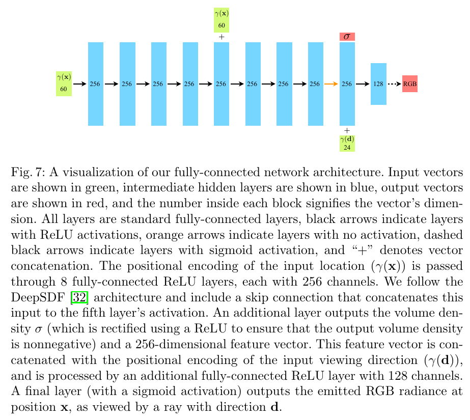
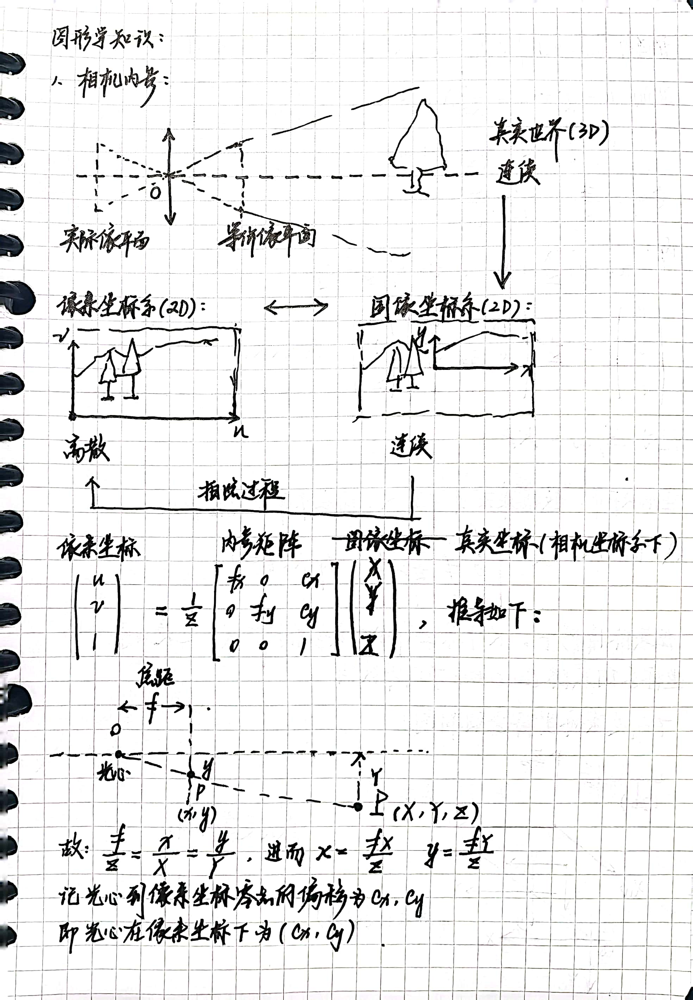
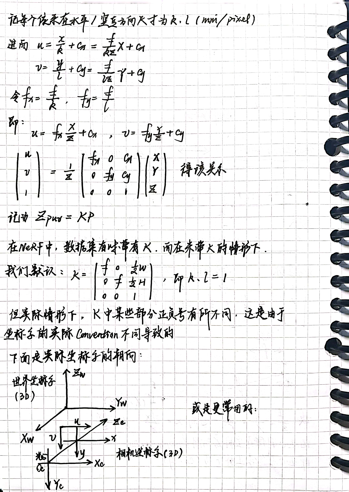
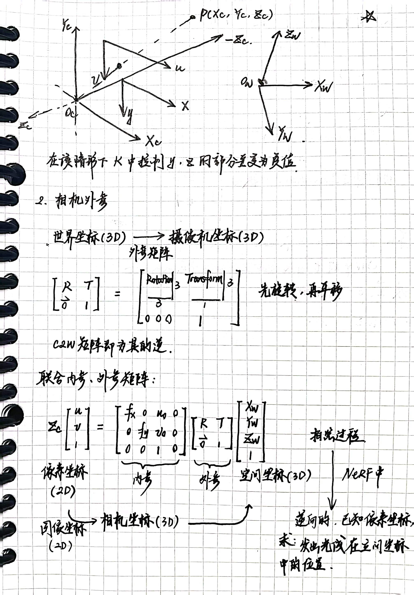
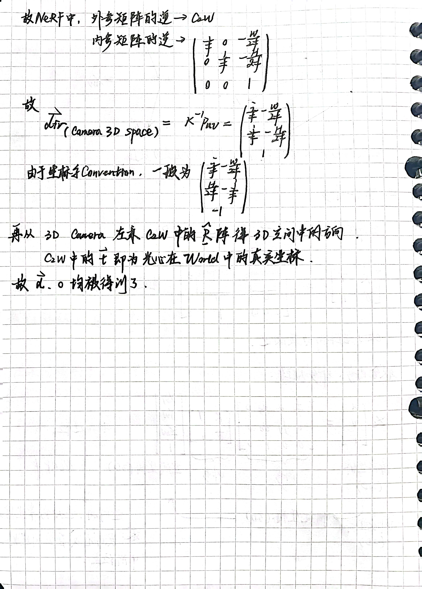
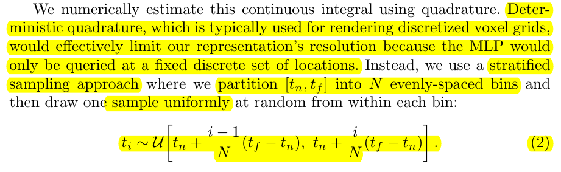
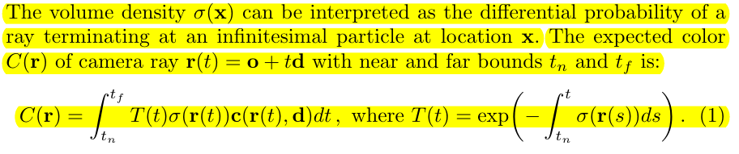
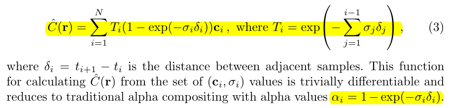

# NeRF Code Instruction

## Vanilla NeRF

### Arguments

#### Path configuration

|Argument|Meaning|Settings|
|--|--|--|
|`--config`|Config file path|`is_config_file=True`|
|`--expname`|Experiment name|
|`--basedir`|Where to store ckpts and logs|`default='./logs/'`|
|`--datadir`|Input data directory|`default='./data/llff/fern'`|

#### Training options

|Argument|Meaning|Settings|
|--|--|--|
|`--netdepth`|Layers in network|`default=8`|
|`--netwidth`|Channels per layer|`default=256`|
|`--netdepth_fine`|Layers in fine network|`default=8`|
|`--netwidth_fine`|Channels per layer in fine network|`default=256`|
|`--N_rand`|Batch size (number of random rays per gradient step)||
|`--lrate`|Learning rate|`default=5e-4`|
|`--lrate_decay`|Exponential learning rate decay (in 1000 steps)|`default=250`|
|`--chunk`|Number of rays processed in parallel, decrease if running out of memory|`default=1024 * 32`|
|`--netchunk`|Number of pts sent through network in parallel, decrease if running out of memory|`default=1024 * 64`|
|`--no_batching`|Only take random rays from 1 image at a time|`action='store_true'`|
|`--no_reload`|Do not reload weights from saved ckpt|`action='store_true'`|
|`--ft_path`|Specific weights npy file to reload for coarse network|`default=None`|
|`--precrop_iters`|Number of steps to train on central crops|`default=0`|
|`--precrop_frac`|Fraction of img taken for central crops|`default=.5`|

#### Rendering options

|Argument|Meaning|Settings|
|--|--|--|
|`--N_samples`|Number of coarse samples per ray|`default=64`|
|`--N_importance`|Number of additional fine samples per ray|`default=0`|
|`--perturb`|Set to 0. for no jitter, 1. for jitter|`default=1.`|
|`--use_viewdirs`|Use full 5D input instead of 3D|`action='store_true'`|
|`--i_embed`|Set 0 for default positional encoding, -1 for none|`default=0`|
|`--multires`|log2 of max freq for positional encoding (3D location)|`default=10`|
|`--multires_views`|log2 of max freq for positional encoding (2D direction)|`default=4`|
|`--raw_noise_std`|Std dev of noise added to regularize sigma_a output, 1e0 recommended|`default=0.`|
|`--render_only`|Do not optimize, reload weights and render out render_poses path|`action='store_true'`|
|`--render_test`|Render the test set instead of render_poses path|`action='store_true'`|
|`--render_factor`|Downsampling factor to speed up rendering, set 4 or 8 for fast preview|`default=0`|

#### Dataset options

|Argument|Meaning|Settings|
|--|--|--|
|`--dataset_type`|Options: llff / blender / deepvoxels|`default='llff'`|
|`--testskip`|Will load 1/N images from test/val sets, useful for large datasets like deepvoxels|`default=8`|

##### Deepvoxels flags

|Argument|Meaning|Settings|
|--|--|--|
|`--shape`|Options : armchair / cube / greek / vase|`default='greek'`|

##### Blender flags

|Argument|Meaning|Settings|
|--|--|--|
|`--white_bkgd`|Set to render synthetic data on a white bkgd (always use for dvoxels)|`action='store_true'`|
|`--half_res`|Load blender synthetic data at 400x400 instead of 800x800|`action='store_true'`|

##### llff flags

|Argument|Meaning|Settings|
|--|--|--|
|`--factor`|Downsample factor for LLFF images|`default=8`|
|`--no_ndc`|Do not use normalized device coordinates (set for non-forward facing scenes)|`action='store_true'`|
|`--lindisp`|Sampling linearly in disparity rather than depth|`action='store_true'`|
|`--spherify`|Set for spherical 360 scenes|`action='store_true'`|
|`--llffhold`|Will take every 1/N images as LLFF test set, paper uses 8|`default=8`|

#### Logging/saving options

|Argument|Meaning|Settings|
|--|--|--|
|`--i_print`|Frequency of console printout and metric loggin|`default=100`|
|`--i_image`|Frequency of tensorboard image logging|`default=500`|
|`--i_weights`|Frequency of weight ckpt saving|`default=10000`|
|`--i_testset`|Frequency of testset saving|`default=50000`|
|`--i_video`|Frequency of render_poses video saving|`default=50000`|


### Overall Structure
```
->load_blender_data()
	->pose_spherical()
		->trans_t
		->rot_phi
		->rot_theta
		
->create_nerf()
	->get_embedder()
		->Embedder
			->__init__()
			->create_embedding_fn()
			->embed()
	->NeRF(nn.Module)
		->__init__()
		->forward()
		->load_weights_from_keras()
	->run_network()
		->batchify()
	->torch.optim.Adam()
	-># Load checkpoints

->render_path()
	->render()
		->get_rays()
		->ndc_rays()
		->batchify_rays()
			->render_rays()
				->raw2outputs()
				->sample_pdf()
			
```

### Load Data

There are 4 types of data in Vanilla NeRF:  `llff`, `blender`, `LINEMOD`, `deepvoxels`.

`load_llff_data.py`, `load_blender_data.py`, `load_LINEMOD_data.py`, `load_deepvoxels_data.py` are responsible for these 4 types of data.

#### Blender
The structure of a blender dataset
```
->main
	->test(imgs)
	->train(imgs)
	->val(imgs)
	->transform_test.json
	->transform_train.json
	->transform_val.json
```

The structure of transforms_{}.json
```
->camera_angle_x
->frames
	->file_path(path of img)
	->rotation
	->transform_matrix(pose)
```

The structure of load_blender_data.py
```
->load_blender_data()
	->pose_spherical()
		->trans_t
		->rot_phi
		->rot_theta
```

* `load_blender_data(basedir, half_res=False, testskip=1)`:

|Input Parameter|Meaning|Argument|
|--|--|--|
|basedir|The path of the dataset|\--datadir|
|half_res|Load blender synthetic data at 400x400 instead of 800x800 if True|\--half_res|
|testskip|Load 1/N images from test/val sets, useful for large datasets like deepvoxels|\--testskip|
---------------------------------
|Output|Meaning|
|--|--|
|imgs|A numpy array that stores all the images|
|poses|A numpy array that stores all the poses of the camera|
|render_poses|Poses used for specific view rendering|
|[H, W, focal]|Height, Width, Focal = 0.5*W/np.tan(0.5\*camera_angle_x) |
|i_split|A list containing the index of datasets in 3 groups: train, val, test. Each group's indices are stored in the form of numpy arrays.|

* `pose_spherical(theta, phi, radius):`

|Input Parameter|Meaning|
|--|--|
|theta|rotation around X-axis|
|phi|rotation around Y-axis|
|radius|translation on Z-axis|
----------------------------------
|Output|Meaning|
|--|--|
|c2w|A camera2world matrix returned in the form of torch.Tensor. It is used for specific view rendering, i.e render_poses in load_blender_data.|
```
c2w = torch.Tensor(np.array([
[-1,0,0,0],
[0,0,1,0],
[0,1,0,0],
[0,0,0,1]]) 
@ rot_theta(theta/180.*np.pi) 
@ rot_phi(phi/180.*np.pi) 
@ trans_t(radius))
```

* `trans_t`:
```
lambda t : torch.Tensor([
    [1,0,0,0],
    [0,1,0,0],
    [0,0,1,t],
    [0,0,0,1]]).float()
```
* `rot_phi`:
```
lambda phi : torch.Tensor([
    [1,0,0,0],
    [0,np.cos(phi),-np.sin(phi),0],
    [0,np.sin(phi), np.cos(phi),0],
    [0,0,0,1]]).float()
```
* `rot_theta`
```
lambda th : torch.Tensor([
    [np.cos(th),0,-np.sin(th),0],
    [0,1,0,0],
    [np.sin(th),0, np.cos(th),0],
    [0,0,0,1]]).float()
```

#### Implementation of Blender in train()
```
    elif args.dataset_type == 'blender':
        images, poses, render_poses, hwf, i_split = load_blender_data(args.datadir, args.half_res, args.testskip)
        print('Loaded blender', images.shape, render_poses.shape, hwf, args.datadir)
        i_train, i_val, i_test = i_split

        near = 2.
        far = 6.

        if args.white_bkgd:
            images = images[..., :3] * images[..., -1:] + (1. - images[..., -1:])
        else:
            images = images[..., :3]
```
* Range of ray:
```
near = 2.
far = 6.
```
* White Background:
```
        if args.white_bkgd:
            images = images[..., :3] * images[..., -1:] + (1. - images[..., -1:])
        else:
            images = images[..., :3]
```
In this part, we will not only deal with the white background, but also the transform of the image channel(.png's PGBA -> RGB).

RGB: 0 0 0: black 1 1 1: white (0~1 RGB space)

A: alpha, represents the transparency. If alpha=0%, the pixel is completely transparent. If alpha=100%, the pixel is completely not transparent.

White background transform: RGB*A + (1-A)

### Configs
* Cast HWF to right types
```
    H, W, focal = hwf
    H, W = int(H), int(W)
    hwf = [H, W, focal]

```
* K: Camera Intrinsic Matrix
```
    if K is None:
        K = np.array([
            [focal, 0, 0.5 * W],
            [0, focal, 0.5 * H],
            [0, 0, 1]
        ])
```
* Prepare test poses for rendering and move them to GPU
```
    if args.render_test:
        render_poses = np.array(poses[i_test])
    # default: render_poses from load_blender_data()    
        
    render_poses = torch.Tensor(render_poses).to(device)
```

* Create log dir and copy the config file
```
    basedir = args.basedir
    expname = args.expname
    os.makedirs(os.path.join(basedir, expname), exist_ok=True)
    f = os.path.join(basedir, expname, 'args.txt')
    with open(f, 'w') as file:
        for arg in sorted(vars(args)):
            attr = getattr(args, arg)
            file.write('{} = {}\n'.format(arg, attr))
    if args.config is not None:
        f = os.path.join(basedir, expname, 'config.txt')
        with open(f, 'w') as file:
            file.write(open(args.config, 'r').read())
```

### Create NeRF model

This part is done by `create_nerf` function in `run_nerf.py`.
```
->create_nerf()
	->get_embedder()
	->NeRF(nn.Module)
	->run_network()
	->torch.optim.Adam()
	-># Load checkpoints
```

|Input Parameter|Meaning|
|--|--|
|args|Arguments|
-------------------------------
|Output|Meaning|
|--|--|
|render_kwargs_train|A dict that stores config of training for rendering.|
|render_kwargs_test|A dict that stores config of testing for rendering.|
|start|Global step|
|grad_vars|Model(coarse or fine) parameters|
|optimizer|Adam optimizer|
--------------------------------
|render_kwargs_train/test|
|--|

|Key|Meaning|Argument|
|--|--|--|
|network_query_fn|Parameterized `run_network` function|
|perturb|Set to 0. for no jitter, 1. for jitter. Always False in test.|\--perturb|
|N_importance|Number of additional fine samples per ray|\--N_importance|
|network_fine|Model fine|
|N_samples|Number of coarse samples per ray|\--N_samples|
|network_fn|Model coarse|
|use_viewdirs|Use full 5D input instead of 3D|\--use_viewdirs|
|white_bkgd|Set to render synthetic data on a white bkgd (always use for dvoxels)|\--white_bkgd|
|raw_noise_std|Std dev of noise added to regularize sigma_a output, 1e0 recommended. Always 0. in test.|\--raw_noise_std|
|ndc|Use NDC if True. Only good for LLFF-style forward facing data.|!\--no_ndc|
|lindisp|Sampling linearly in disparity rather than depth. Ignore this part in NDC.|\--lindisp|

NDC can be referred in Appendix C of the original paper.

#### Embedder

This part is done by `get_embedder` function in `run_nerf_helper.py`.
```
->get_embedder()
	->Embedder
```
In the paper, it is related to the equation below:


* `get_embedder(multires, i=0)`:

|Input Parameter|Meaning|Argument|
|--|--|--|
|multires|log2 of max freq for positional encoding (3D location/2D direction)|\--multires, \--multires_view|
|i|set 0 for default positional encoding, -1 for none|\--i_embed|

A dict named `embed_kwargs` will be created and used to create an `embedder_obj` under class `Embedder` inside the function. 
```
embed_kwargs = {
                'include_input' : True,
                'input_dims' : 3,
                'max_freq_log2' : multires-1,
                'num_freqs' : multires,
                'log_sampling' : True,
                'periodic_fns' : [torch.sin, torch.cos],
    }
```

|Output(i=0)|Meaning|
|--|--|
|embed|A function whose effect equals to `embedder_obj.embed()`|
|embedder_obj.out_dim|Dimension after the embedding|

|Output(i=-1)|Value|
|--|--|
|embed|`nn.Identity()`|
|embedder_obj.out_dim|`embed_kwargs["input_dims"]=3`|

* `Embedder(**kwargs)`:

`Embedder` is a class for generating embeddings. 
```
->Embedder
	->__init__()
	->create_embedding_fn()
	->embed()
```

`__init__(self, **kwargs)`: 

|Member|Type|Value|
|--|--|--|
|self.kwargs|dict|kwargs|
|self.create_embedding_fn()|function|None|


`create_embedding_fn(self)`:

|Member|Meaning|
|--|--|
|self.embed_fns|list of embedding functions|
|self.out_dim|dimension after the embedding|
------------------------------------
|Detail of self.kwargs|
|--|

|Key|Meaning|
|--|--|
|include_input|Include input itself(identity: `lambda x : x`) in the output series of high-frequency embedding functions if True|
|input_dims|Input dimensions|
|max_freq_log2|log2 of the max frequency among the embedding function groups(a group of functions have the same frequency but different functions)|
|num_freqs|Number of high frequency embedding function groups(a group of functions have the same frequency but different functions). Input itself(identity: `lambda x : x`) is excluded!|
|log_sampling|Frequency groups(or bands): `2.**torch.linspace(0.,max_freq_log2,step=num_freqs)` if True; `torch.linspace(2.**0., 2.**max_freq_log2,step=num_freqs)` if False.|
|periodic_fns|A list of periodic functions that are applied to all the frequency groups(or bands)|
------------------------------------
|self.out_dim|
|--|

|self.kwargs['include_input']|Value|
|--|--|
|True|`self.kwargs['input_dims']*(len(self.kwargs['periodic_fns'])*self.kwargs['num_freqs']+1)`|
|False|`self.kwargs['input_dims']*(len(self.kwargs['periodic_fns'])*self.kwargs['num_freqs'])`| 

embed(self, inputs):
```
	return torch.cat([fn(inputs) for fn in self.embed_fns], -1)
```

#### Implementation of Embedder in create NeRF model
```
	embed_fn, input_ch = get_embedder(args.multires, args.i_embed)
	input_ch_views = 0
	embeddirs_fn = None
	if args.use_viewdirs:
		embeddirs_fn, input_ch_views = get_embedder(args.multires_views, args.i_embed)
```

#### MLP

This part is done by `NeRF` class in `run_nerf_helpers.py`.

```
->NeRF(nn.Module)
	->__init__()
	->forward()
	->load_weights_from_keras()
```

The following is its network structure in the paper:



`__init__(self, D=8, W=256, input_ch=3, input_ch_views=3, output_ch=4, skips=[4], use_viewdirs=False)`:

|Member|Meaning|Value|Argument|
|--|--|--|--|
|self.D|Layer num of main MLP part|D|\--netdepth/\--netdepth_fine|
|self.W|Latent dimension of main MLP|W|\--netwidth/\--netwidth_fine|
|self.input_ch|Input position channel|input_ch|
|self.input_ch_views|Input view channel|input_ch_views|
|self.skips|A list that stores the positions of skip connections. The passing latent vector will be concated with input_pts(`torch.cat([input_pts, h], -1)`) at the skip connection.|skips|
|self.use_viewdirs|Use view dependency if True|use_viewdirs|\--use_viewdirs|
|self.pts_linears|Main MLP|`nn.ModuleList([nn.Linear(input_ch, W)] + [nn.Linear(W, W) if i not in self.skips else nn.Linear(W + input_ch, W) for i in range(D-1)])`|
|self.views_linears|View MLP|`nn.ModuleList([nn.Linear(input_ch_views + W, W//2)])`(Official code release)           `nn.ModuleList([nn.Linear(input_ch_views + W, W//2)] + [nn.Linear(W//2, W//2) for i in range(D//2)])`(Paper version)|
|self.feature_linear|Generate feature vector given the latent vector from Main MLP if `self.use_viewdir' is True.|nn.Linear(W, W)|
|self.alpha_linear|Generate density given the latent vector from main MLP if `self.use_viewdir' is True.|nn.Linear(W, 1)|
|self.rgb_linear|Generate RGB given the vector generated by concat vector of feature and input_views(`torch.cat([feature, input_views], -1)`) going through View MLP if `self.use_viewdir' is True.|nn.Linear(W//2, 3)|
|self.output_linear|Give the output directly if `self.use_viewdir' is False.|nn.Linear(W, output_ch)|

`forward(self, x)`:

|Input|Meaning|
|--|--|
|x|Input x includes input positions as well as input view directions. So it will be split by `torch.split(x, [self.input_ch, self.input_ch_views], dim=-1)` in the function.|
------------------------
|Output|View dependency|
|--|--|
|`outputs = self.output_linear(h)` where `h` is the latent vector from the Main MLP|False|
|`outputs = torch.cat([rgb, alpha], -1)` where `rgb` is the result of `self.rgb_linear()` and `alpha` is the result of `self.alpha_linear()`.|True|

`load_weights_from_keras(self, weights)`:

```
assert self.use_viewdirs, "Not implemented if use_viewdirs=False"
```

Load trained weights from a dict that stores weights of the network in numpy array dtype `weights`.

#### Implementation of MLP in create NeRF model

```
    output_ch = 5 if args.N_importance > 0 else 4
    skips = [4]
    model = NeRF(D=args.netdepth, W=args.netwidth,
                 input_ch=input_ch, output_ch=output_ch, skips=skips,
                 input_ch_views=input_ch_views, use_viewdirs=args.use_viewdirs).to(device)
    grad_vars = list(model.parameters())

    model_fine = None
    if args.N_importance > 0:
        model_fine = NeRF(D=args.netdepth_fine, W=args.netwidth_fine,
                          input_ch=input_ch, output_ch=output_ch, skips=skips,
                          input_ch_views=input_ch_views, use_viewdirs=args.use_viewdirs).to(device)
        grad_vars += list(model_fine.parameters())
```

* `model`: coarse NeRF model
* `model_fine`: fine NeRF model, None if `--N_importance<=0`. 
* `args.N_importance`: `--N_importance`, number of additional fine samples per ray
* `grad_var`: A list that stores all the models' parameters.

#### Run NeRF network

This part is packed as a function `run_network` function in `run_nerf.py`.

```
->run_network()
	->batchify()
```

* `run_network(inputs, viewdirs, fn, embed_fn, embeddirs_fn, netchunk=1024 * 64)`:

|Input Parameter|Meaning|Argument|Transformation|
|--|--|--|--|
|inputs|Input positions in the shape of [ray_number, sample_number_per_ray, position_channel]. It will be flattened to `inputs_flat = torch.reshape(inputs, [-1, inputs.shape[-1]])` inside the function.||[ray_number, sample_number_per_ray, position_channel]->[ray_number * sample_number_per_ray, position_channel]|
|viewdirs|Input view directions in the shape of [ray_number, view_direction_channel]. It will be expanded and flattened to `input_dirs = viewdirs[:, None].expand(inputs.shape)     input_dirs_flat = torch.reshape(input_dirs, [-1, input_dirs.shape[-1]])`||[ray_number, view_direction_channel]->[ray_number, 1, view_direction_channel]->[ray_number, sample_number_per_ray, view_direction_channel]->[ray_number * sample_number_per_ray, view_direction_channel]|
|fn|Model coarse or fine||
|embed_fn|Embedding function for positions. `embed_fn(inputs_flat)`||
|embeddirs_fn|Embedding function for view directions. `embeddirs_fn(input_dirs_flat)`||
|netchunk|Number of positions sent through network in parallel, decrease if running out of memory|\--netchunk|
---------------------------------------
|Inner Variable|Value|
|--|--|
|embedded|`embed_fn(inputs_flat)` if `viewdirs` is None;   `torch.cat([embed_fn(inputs_flat), embeddirs_fn(input_dirs_flat)], -1)` if `viewdirs` is not None|
|`outputs_flat`|`batchify(fn, netchunk)(embedded)`|
----------------------------------------
|Output|Value|
|--|--|
|outputs|`torch.reshape(outputs_flat, list(inputs.shape[:-1]) + [outputs_flat.shape[-1]])`|

* `batchify(fn, chunk)`:

The function is used for constructing a version of 'fn' that applies to smaller batches.

|Input Parameter|Meaning|Argument|
|--|--|--|
|fn|Model coarse or fine||
|chunk|Number of positions sent through network in parallel, decrease if running out of memory|\--netchunk|

The return value of this function is a batchified `fn`.

|Output|Chunk|
|--|--|
|`fn`|None|
|`lambda inputs: torch.cat([fn(inputs[i:i + chunk]) for i in range(0, inputs.shape[0], chunk)], 0)`, where inputs should be the shape of [ray_number * sample_number_per_ray, position_channel+view_direction_channel]|Not None|

#### Implementation of run_network

```
    network_query_fn = lambda inputs, viewdirs, network_fn: run_network(inputs, viewdirs, network_fn,
                                                                        embed_fn=embed_fn,
                                                                        embeddirs_fn=embeddirs_fn,
                                                                        netchunk=args.netchunk)

```

#### Optimizer

```
optimizer = torch.optim.Adam(params=grad_vars, lr=args.lrate, betas=(0.9, 0.999))
```

* Set grad_vars as the optimizing parameters.

* Set learning rate as `--lrate`.

#### Load checkpoints

```
    start = 0
    basedir = args.basedir
    expname = args.expname
    # Load checkpoints
    if args.ft_path is not None and args.ft_path != 'None':
        ckpts = [args.ft_path]
    else:
        ckpts = [os.path.join(basedir, expname, f) for f in sorted(os.listdir(os.path.join(basedir, expname))) if
                 'tar' in f]

    print('Found ckpts', ckpts)
    if len(ckpts) > 0 and not args.no_reload:
        ckpt_path = ckpts[-1]
        print('Reloading from', ckpt_path)
        ckpt = torch.load(ckpt_path)

        start = ckpt['global_step']
        optimizer.load_state_dict(ckpt['optimizer_state_dict'])

        # Load model
        model.load_state_dict(ckpt['network_fn_state_dict'])
        if model_fine is not None:
            model_fine.load_state_dict(ckpt['network_fine_state_dict'])
```

* `--basedir`: where to store ckpts and logs.
* `--expname`: experiment name.
* `--ft_path`: specific weights npy file to reload for coarse network  
* `--no_reload`: do not reload weights from saved ckpt if True

#### Implementation of create NeRF in train()
```
    render_kwargs_train, render_kwargs_test, start, grad_vars, optimizer = create_nerf(args)
    global_step = start

    bds_dict = {
        'near': near,
        'far': far,
    }
    render_kwargs_train.update(bds_dict)
    render_kwargs_test.update(bds_dict)
```

|Additional key-value pair to render_kwargs_train/test|
|--|

|Key|Meaning|
|--|--|
|near||
|far||

### Render

#### Render Pipeline

This part is done by `render_path` function in `run_nerf.py`.

```
->render_path()
	->render()
```

* `render_path(render_poses, hwf, K, chunk, render_kwargs, gt_imgs=None, savedir=None, render_factor=0)`:

`return rgbs, disps`

The function is used to render the results in all directions.

|Input Parameter|Meaning|Argument|
|--|--|--|
|render_poses|Camera poses to be rendered.||
|hwf|[Height, Width, Focal]||
|K|Camera intrinsic matrix||
|chunk|Number of rays processed in parallel, decrease if running out of memory|\--chunk|
|render_kwargs|Render config including model, run_model_function, settings, etc. `render_kwargs_train/test`||
|gt_imgs|||
|savedir|Path to save rendered results.||
|render_factor|Downsampling factor to speed up rendering, set 4 or 8 for fast preview|\--render_factor|

|Acceleration down-sampling|
|--|
```
    H, W, focal = hwf

    if render_factor != 0:
        # Render downsampled for speed
        H = H // render_factor
        W = W // render_factor
        focal = focal / render_factor
```

|Rendering of different views and generating results|
|--|
```
    rgbs = []
    disps = []

    t = time.time()
    for i, c2w in enumerate(tqdm(render_poses)):
        print(i, time.time() - t)
        t = time.time()
        rgb, disp, acc, _ = render(H, W, K, chunk=chunk, c2w=c2w[:3, :4], **render_kwargs)
        rgbs.append(rgb.cpu().numpy())
        disps.append(disp.cpu().numpy())
        if i == 0:
            print(rgb.shape, disp.shape)

        """
        if gt_imgs is not None and render_factor==0:
            p = -10. * np.log10(np.mean(np.square(rgb.cpu().numpy() - gt_imgs[i])))
            print(p)
        """

        if savedir is not None:
            rgb8 = to8b(rgbs[-1])
            filename = os.path.join(savedir, '{:03d}.png'.format(i))
            imageio.imwrite(filename, rgb8)
```
|Output|
|--|
`return rgbs, disps`


* `render(H, W, K, chunk=1024 * 32, rays=None, c2w=None, ndc=True, near=0., far=1., use_viewdirs=False, c2w_staticcam=None, **kwargs)`:
```
->render()
	->get_rays()
	->ndc_rays()
	->batchify_rays()
```

`return ret_list + [ret_dict]`

The function is used to complete the rendering process of a certain view from the very beginning.

|Input Parameter|Meaning|Argument|
|--|--|--|
|H|Height of image in pixels.||
|W|Width of image in pixels.||
|K|Camera intrinsic matrix.||
|chunk|Maximum number of rays to process simultaneously. Used to control maximum memory usage. Does not affect final results.|\--chunk|
|rays|Ray origin and direction for each example in batch. Array of shape [2, batch_size, 3].||
|c2w|Camera-to-world transformation matrix. Array of shape [3, 4].||
|ndc|Ray origin, direction in NDC coordinates if True|!\--no_ndc|
|near|Nearest distance for a ray. Float or array of shape [batch_size].||
|far|Farthest distance for a ray. Float or array of shape [batch_size].||
|use_viewdirs|Use viewing direction of a point in space in model if True.|\--use_viewdirs|
|c2w_staticcam|Use this transformation matrix for camera while using other c2w argument for viewing directions if not None. Array of shape [3, 4].||
|kwargs|Extra options to be added.||
------------------------------------
|Forming directions and origin of rays|
|--|
```
    if c2w is not None:
        # special case to render full image
        rays_o, rays_d = get_rays(H, W, K, c2w)
    else:
        # use provided ray batch
        rays_o, rays_d = rays

    if use_viewdirs:
        # provide ray directions as input
        viewdirs = rays_d
        if c2w_staticcam is not None:
            # special case to visualize effect of viewdirs
            rays_o, rays_d = get_rays(H, W, K, c2w_staticcam)
        viewdirs = viewdirs / torch.norm(viewdirs, dim=-1, keepdim=True)
        viewdirs = torch.reshape(viewdirs, [-1, 3]).float()

    sh = rays_d.shape  # [..., 3]
    if ndc:
        # for forward facing scenes
        rays_o, rays_d = ndc_rays(H, W, K[0][0], 1., rays_o, rays_d)

    # Create ray batch
    rays_o = torch.reshape(rays_o, [-1, 3]).float()
    rays_d = torch.reshape(rays_d, [-1, 3]).float()
    
    near, far = near * torch.ones_like(rays_d[..., :1]), far * torch.ones_like(rays_d[..., :1])
    rays = torch.cat([rays_o, rays_d, near, far], -1)
    if use_viewdirs:
        rays = torch.cat([rays, viewdirs], -1)    
```
---------------------------------
|Render and Reshape|
|--|
```
    all_ret = batchify_rays(rays, chunk, **kwargs)
    for k in all_ret:
        k_sh = list(sh[:-1]) + list(all_ret[k].shape[1:])
        all_ret[k] = torch.reshape(all_ret[k], k_sh)
```
-----------------------------------
|Output in the form of list|
|--|
```
    k_extract = ['rgb_map', 'disp_map', 'acc_map']
    ret_list = [all_ret[k] for k in k_extract]
    ret_dict = {k: all_ret[k] for k in all_ret if k not in k_extract}
    return ret_list + [ret_dict]
```

* `get_rays(H, W, K, c2w)/get_rays_np(H, W, K, c2w)`:

`return rays_o, rays_d`

The function is used to get rays' directions and origin of one view to be rendered.

|Input Parameter|Meaning|Argument|
|--|--|--|
|H|Height of the image in pixels.||
|W|Width of the image in pixels.||
|K|Camera intrinsic matrix.||
|c2w|Camera to world matrix. Inverse of world to camera matrix(Camera extrinsic matrix.).||

Knowledge of coordinates transformation:









```
    i, j = torch.meshgrid(torch.linspace(0, W-1, W), torch.linspace(0, H-1, H))  # pytorch's meshgrid has indexing='ij'
    i = i.t()
    j = j.t()
    dirs = torch.stack([(i-K[0][2])/K[0][0], -(j-K[1][2])/K[1][1], -torch.ones_like(i)], -1)
    # Rotate ray directions from camera frame to the world frame
    rays_d = torch.sum(dirs[..., np.newaxis, :] * c2w[:3,:3], -1)  # dot product, equals to: [c2w.dot(dir) for dir in dirs]
    # Translate camera frame's origin to the world frame. It is the origin of all rays.
    rays_o = c2w[:3,-1].expand(rays_d.shape)
    return rays_o, rays_d
```

|Inner Variable|Value|Shape|
|--|--|--|
|i|`i, j = torch.meshgrid(torch.linspace(0, W-1, W), torch.linspace(0, H-1, H)) i = i.t()`|[W, H]->[H, W]|
|j|`i, j = torch.meshgrid(torch.linspace(0, W-1, W), torch.linspace(0, H-1, H)) j = j.t()`|[W, H]->[H, W]|
|dirs|`torch.stack([(i-K[0][2])/K[0][0], -(j-K[1][2])/K[1][1], -torch.ones_like(i)], -1)`|[H, W, 3]|

|Output|Value|Shape|
|--|--|--|
|rays_o|`c2w[:3,-1].expand(rays_d.shape)`|[H, W, 3]|
|rays_d|`torch.sum(dirs[..., np.newaxis, :] * c2w[:3,:3], -1)`|[H, W ,3]|

(np version likewise)

* `ndc_rays(H, W, focal, near, rays_o, rays_d)`:

`return rays_o, rays_d`

The function is used to transform rays of one certain view to be rendered into ndc coordinate. 

(In progress)

* `batchify_rays()`:
```
->batchify_rays()
	->render_rays()
```

`return all_ret`

The function is used to batchify all rays and render them batch by batch. Render rays in smaller minibatches to avoid OOM.

|Input Parameter|Meaning|Argument|Shape|
|--|--|--|--|
|rays_flat|Flattened all rays in a group.||[N_rays, 11] or [N_rays, 8]|
|chunk|Number of rays processed in parallel, decrease if running out of memory.|\--chunk|
|**kwargs|||
----------------------------
```
    all_ret = {}
    for i in range(0, rays_flat.shape[0], chunk):
        ret = render_rays(rays_flat[i:i + chunk], **kwargs)
        for k in ret:
            if k not in all_ret:
                all_ret[k] = []
            all_ret[k].append(ret[k])

    all_ret = {k: torch.cat(all_ret[k], 0) for k in all_ret}
```
----------------------------
|Output|Type|
|--|--|
|all_ret|dict|

* `render_rays(ray_batch, network_fn, network_query_fn, N_samples, retraw=False, lindisp=False, perturb=0., N_importance=0, network_fine=None, white_bkgd=False, raw_noise_std=0., verbose=False, pytest=False))`:
```
->render_rays()
	->raw2outputs()
	->sample_pdf()
```

`return ret`

The function is used to render a batch of rays.

|Input Parameter|Meaning|Argument|
|--|--|--|
|ray_batch|All information necessary for sampling along a ray, including: ray origin, ray direction, min dist, max dist, and unit-magnitude viewing direction. Array of shape [batch_size, ...].||
|network_fn|Model coarse.||
|network_query_fn|Parameterized `run_network` function.||
|N_samples|Number of coarse samples along each ray.|\--N_samples|
|retraw|Include model's raw, unprocessed predictions if True.||
|lindisp|Sample linearly in inverse depth rather than in depth if True. Ignore this part in NDC.|\--lindisp|
|perturb|Each ray is sampled at stratified random points in time if none zero. Set to 0. for no jitter, 1. for jitter|\--perturb|
|N_importance|Number of additional fine samples per ray|\--N_importance|
|network_fine|Model fine.||
|white_bkgd|Set to render synthetic data on a white bkgd (always use for dvoxels)|\--white_bkgd|
|raw_noise_std|Std dev of noise added to regularize sigma_a output, 1e0 recommended|\--raw_noise_std|
|verbose|Print more debug info if True.||
|pytest|||
-----------------------------------
|Partition from `ray_batch`|
|--|

|Inner Variable|Meaning|Shape|
|--|--|--|
|ray_batch|Ray batch.|[N_rays, 11]|
|rays_o|Origins of the rays.|`ray_batch[:,0:3]`|
|rays_d|Directions of the rays.|`ray_batch[:,3:6]`|
|bounds|Bounds of the rays.|`ray_batch[:,6:8].reshape([-1, 1, 2])`|
|near|Nearest bound.|`bounds[..., 0]`(shape:  [N_rays, 1])|
|far|Farthest bound.|`bounds[..., 1]`(shape: [N_rays, 1])|
|viewdirs|Unit-magnitude viewing directions.|`ray_batch[:, -3:] if ray_batch.shape[-1] > 8 else None`|
-------------------------------------
|Sample positions along rays|
|--|

|Inner Variable|Meaning|Value|Shape|
|--|--|--|--|
|t_vals|Create a tensor with `N_samples` elements that divide [0,1] interval equally. `t_vals[0] = 0.` `t_vals[-1]=1.`|`torch.linspace(0., 1., steps=N_samples)`|[N_samples]|
|z_vals(original, perturb = 0)|Linearly distributed `N_samples` points in [near, far]. Map t_zals to each ray's interval [near, far].|`lindisp` is True: `1. / (1. / near * (1. - t_vals) + 1. / far * (t_vals))`;                                                                   `lindisp` is False: `near * (1. - t_vals) + far * (t_vals)`|[N_rays, N_samples]|
|mids|Middle point of each small interval `z_vals(original, perturb = 0)` given. Used when `perturb>0`|`.5 * (z_vals[..., 1:] + z_vals[..., :-1])`|[N_rays, N_samples-1]|
|upper|Upper bounds of the novel small intervals `z_vals(original, perturb = 0)` given. Used when `perturb>0`|`torch.cat([mids, z_vals[..., -1:]], -1)`|[N_rays, N_samples]|
|lower|Lower bounds of the novel small intervals `z_vals(original, perturb = 0)` given. Used when `perturb>0`|`torch.cat([z_vals[..., :1], mids], -1)`|[N_rays, N_samples]|
|t_rand|Uniform sampling from [0,1). Used when `perturb>0`|`torch.rand(z_vals.shape)`|[N_rays, N_samples]|
|z_vals(novel, perturb>0)|Linearly distributed `N_samples` points in [near, far] with jitter added.|`lower + (upper - lower) * t_rand`|[N_rays, N_samples]|
|pts|Positions of sampled points expressed with coordinates.|`rays_o[..., None, :] + rays_d[..., None, :] * z_vals[..., :, None]`|[N_rays, N_samples, 3]|

Uniform sampling in the paper:



|Get radiance and density by inputting positions and view directions to the model coarse.|
|--|

|Inner Variable|Meaning|Value|Shape|
|--|--|--|--|
|raw|Raw outputs containing radiance and density of each sample point.|`network_query_fn(pts, viewdirs, network_fn)`|[N_rays, N_samples, 4]|
-------------------------------------
|Dealing with the `raw` data|
|--|

|Inner Variable|Meaning|Value|Shape|
|--|--|--|--|
|rgb_map(original, coarse output, `={}_0` if `N_importance>0`)|Rendered RGB map.|`raw2outputs(raw, z_vals, rays_d, raw_noise_std, white_bkgd, pytest=pytest)[0]`|[N_rays, 3]|
|disp_map(original, coarse output, `={}_0` if `N_importance>0`)||`raw2outputs(raw, z_vals, rays_d, raw_noise_std, white_bkgd, pytest=pytest)[1]`|[N_rays]|
|acc_map(original, coarse output, `={}_0` if `N_importance>0`)||`raw2outputs(raw, z_vals, rays_d, raw_noise_std, white_bkgd, pytest=pytest)[2]`|[N_rays]|
|weights(original, coarse output, `={}_0` if `N_importance>0`)|alpha*T in the paper.|`raw2outputs(raw, z_vals, rays_d, raw_noise_std, white_bkgd, pytest=pytest)[3]`|[N_rays, N_samples]|
|depth_map(original, coarse output, `={}_0` if `N_importance>0`)|Depth map. sum(weights*z_vals) is regarded as equivalent depth here.|`raw2outputs(raw, z_vals, rays_d, raw_noise_std, white_bkgd, pytest=pytest)[4]`|[N_rays]|
---------------------------------------
|Use fine model if `N_importance > 0`|
|--|

|Inner Variable|Meaning|Value|Shape|
|--|--|--|--|
|rgb_map_0|rgb_map(original, coarse output, `={}_0` if `N_importance>0`)|rgb_map(original, coarse output, `={}_0` if `N_importance>0`)|[N_rays, 3]|
|disp_map_0|disp_map(original, coarse output, `={}_0` if `N_importance>0`)|disp_map(original, coarse output, `={}_0` if `N_importance>0`)|[N_rays]|
|acc_map_0|acc_map(original, coarse output, `={}_0` if `N_importance>0`)|acc_map(original, coarse output, `={}_0` if `N_importance>0`)|[N_rays]|
|z_vals_mid|Mid points of z_vals.|`.5 * (z_vals[..., 1:] + z_vals[..., :-1])`|[N_rays, N_samples-1]|
|z_samples|Sampling positions in fine model according to the weights in coarse model. Detached so won't be calculated with gradients.|`z_samples = sample_pdf(z_vals_mid, weights[..., 1:-1], N_importance, det=(perturb == 0.), pytest=pytest)` `z_samples = z_samples.detach()`|[N_rays,N_importance]|
|z_vals|For each ray, sort the sampling points(original & enhanced) in ascending order of positions.|`z_vals, _ = torch.sort(torch.cat([z_vals, z_samples], -1), -1)`|[N_rays,N_samples+N_importance]|
|pts|Exact position in coordinate expression.|`rays_o[..., None, :] + rays_d[..., None, :] * z_vals[..., :, None]`|[N_rays,N_samples+N_importance,3]|
|run_fn|Fine network function.|`network_fn if network_fine is None else network_fine`||
|raw|Raw outputs from the network.|`network_query_fn(pts, viewdirs, run_fn)`|[N_rays, N_samples+N_importance, 4]|
--------------------------------------------
|Dealing with the `raw` data|
|--|

|Inner Variable|Meaning|Value|Shape|
|--|--|--|--|
|rgb_map||`raw2outputs(raw, z_vals, rays_d, raw_noise_std, white_bkgd, pytest=pytest)[0]`|[N_rays, 3]|
|disp_map||`raw2outputs(raw, z_vals, rays_d, raw_noise_std, white_bkgd, pytest=pytest)[1]`|[N_rays]|
|acc_map||`raw2outputs(raw, z_vals, rays_d, raw_noise_std, white_bkgd, pytest=pytest)[2]`|[N_rays]|
|weights||`raw2outputs(raw, z_vals, rays_d, raw_noise_std, white_bkgd, pytest=pytest)[3]`|[N_rays, N_samples+N_importance]|
|depth_map||`raw2outputs(raw, z_vals, rays_d, raw_noise_std, white_bkgd, pytest=pytest)[4]`|[N_rays]|
--------------------------------------------
|Output|Type|
|--|--|
|ret|dict|
-------------------------------------------
|`ret` Value|
|--|

|Key|Value|Shape|
|--|--|--|
|rgb_map|`rgb_map`|[N_rays, 3]|
|disp_map|`disp_map`|[N_rays]|
|acc_map|`acc_map`|[N_rays]|
|raw|`If retraw:` `raw`|[N_rays, N_samples+N_importance, 4] or [N_rays, N_samples, 4]|
|rgb0|`If retraw:` `rgb_map_0`|[N_rays]|
|disp0|`If retraw:` `disp_map_0`|[N_rays]|
|acc0|`If retraw:` `acc_map_0`|[N_rays]|
|z_std|`If retraw:` `torch.std(z_samples, dim=-1, unbiased=False)`|[N_rays]|

* `raw2outputs(raw, z_vals, rays_d, raw_noise_std=0, white_bkgd=False, pytest=False)`:

`return rgb_map, disp_map, acc_map, weights, depth_map`

This function is used to turn the raw results(radiance and density of each position) from the models into rendered images(rendered rays).

The volume-rendering equation will be involved here.

 

Its discrete version:

 

|Input Parameter|Meaning|Argument|
|--|--|--|
|raw|Prediction from model. [N_rays, N_samples, 4]|
|z_vals|Integration time. [N_rays, N_samples]|
|rays_d|Direction of each ray. [N_rays, 3]|
|raw_noise_std|Std dev of noise added to regularize sigma_a output, 1e0 recommended|\--raw_noise_std|
|white_bkgd|Set to render synthetic data on a white bkgd (always use for dvoxels)|\--white_bkgd|
|pytest||
---------------------------------
|Inner Variable|Meaning|Value|Shape|
|--|--|--|--|
|dists|Distances between sampled points.|`dists = z_vals[..., 1:] - z_vals[..., :-1]` `dists = torch.cat([dists, torch.Tensor([1e10]).expand(dists[..., :1].shape)], -1)` `dists = dists * torch.norm(rays_d[..., None, :], dim=-1)`|[N_rays, N_samples-1] -> [N_rays, N_samples] -> [N_rays, N_samples]|
|rgb|RGB part in `raw` is directly output by a linear layer. It will be transformed to [0,1] here.|`torch.sigmoid(raw[..., :3])`|[N_rays, N_samples, 3]|
|noise|Noise added to alpha value.|0. if `raw_noise_std = 0`; `torch.randn(raw[..., 3].shape) * raw_noise_std` if `raw_noise_std > 0`|[N_rays, N_samples]|
|alpha|Calculated alpha value according to the paper.|`raw2alpha(raw[..., 3] + noise, dists)`, where `raw2alpha = lambda raw, dists, act_fn=F.relu: 1. - torch.exp(-act_fn(raw) * dists)`|[N_rays, N_samples]|
-------------------------------------
|Output|Meaning|Value|Shape|
|--|--|--|--|
|weights|alpha*T in the paper.|`weights = alpha * torch.cumprod(torch.cat([torch.ones((alpha.shape[0], 1)), 1. - alpha + 1e-10], -1), -1)[:, :-1]`|[N_rays, N_samples]|
|rgb_map|Rendered RGB map.|`torch.sum(weights[..., None] * rgb, -2)` if `white_bkgd` is True; `torch.sum(weights[..., None] * rgb, -2) + (1. - acc_map[..., None])` if `white_bkgd` is False|[N_rays, 3]|
|depth_map|Depth map. `sum(weights*z_vals)` is regarded as equivalent depth here.|`torch.sum(weights * z_vals, -1)`|[N_rays]|
|disp_map||`1. / torch.max(1e-10 * torch.ones_like(depth_map), depth_map / torch.sum(weights, -1))`|[N_rays]|
|acc_map||`acc_map = torch.sum(weights, -1)`|[N_rays]|

* `sample_pdf(bins, weights, N_samples, det=False, pytest=False)`:

`return samples`

The function is used to get new sampling positions in fine model according to the weights we gained in the coarse model. 

|Input Parameter|Meaning|Argument|Shape|
|--|--|--|--|
|bins|Mid points of bins in coarse model.||`z_vals_mid = .5 * (z_vals[..., 1:] + z_vals[..., :-1])` [N_rays, N_samples-1]|
|weights|alphai*Ti in the paper, where i=2,...,N_samples-1||`weights[...,1:-1]` [N_rays, N_samples-2]|
|N_samples|Sampling number along the ray in fine model.|\--N_importance||
|det|`(perturb == 0.)`|!\--perturb||
|pytest||||

------------------------------------
|Inner Variable|Meaning|Value|Shape|
|--|--|--|--|
|weights|Weights with prevent nans.|`weights + 1e-5`|[N_rays, N_samples-2]|
|pdf|Turning weights into pdf.|`weights / torch.sum(weights, -1, keepdim=True)`|[N_rays, N_samples-2]|
|cdf|Get cdf.|`cdf = torch.cumsum(pdf, -1)  cdf = torch.cat([torch.zeros_like(cdf[...,:1]), cdf], -1)`|[N_rays, N_samples-1]|
|u|A sampled uniform distribution.|`u = torch.linspace(0., 1., steps=N_samples) u = u.expand(list(cdf.shape[:-1]) + [N_samples])` if `det` is True, `u = torch.rand(list(cdf.shape[:-1]) + [N_samples])` if `det` is False. `u = u.contiguous()`|[N_rays,N_importance]|
|inds|Indices in cdf that is the smallest term among all terms that are larger than the corresponding value in u.|`torch.searchsorted(cdf, u, right=True)`|[N_rays,N_importance]|
|below|Indices in cdf that is the largest term among all terms that are smaller or equal than the corresponding value in u.|`torch.max(torch.zeros_like(inds-1), inds-1)`|[N_rays,N_importance]|
|above|Indices in cdf that is the smallest term among all terms that are larger than the corresponding value in u. If a index is out of range, we substitute it with the maximum index.|`torch.min((cdf.shape[-1]-1) * torch.ones_like(inds), inds)`|[N_rays,N_importance]|
|inds_g|Interval of sampling values locate in.|`torch.stack([below, above], -1)`|[N_rays,N_importance,2]|
|matched_shape|Used to adjust shape.|[N_rays,N_importance,N_samples-1]|[3,]|
|cdf_g|Reshape `cdf` into the shape of `matched_shape`. Then find the values in it corresponding to the indices in `inds_g`.|`torch.gather(cdf.unsqueeze(1).expand(matched_shape), 2, inds_g)`|[N_rays,N_importance,N_samples-1]->[N_rays,N_importance,2]|
|bins_g|Reshape `bin` into the shape of `matched_shape`. Then find the values in it corresponding to the indices in `inds_g`.|`torch.gather(bins.unsqueeze(1).expand(matched_shape), 2, inds_g)`|[N_rays,N_importance,N_samples-1]->[N_rays,N_importance,2]|
|denom|Length of bins.|`denom = (cdf_g[...,1]-cdf_g[...,0]) denom = torch.where(denom<1e-5, torch.ones_like(denom), denom)`|[N_rays,N_importance]|
|t|Exact positions of sampling points in corresponding bins represented with ratio. |`(u-cdf_g[...,0])/denom`|[N_rays,N_importance]|
--------------------------------------
|Output|Meaning|Value|Shape|
|--|--|--|--|
|samples|Sampling points in the fine model.|`bins_g[...,0] + t * (bins_g[...,1]-bins_g[...,0])`|[N_rays,N_importance]|

#### Implementation of render pipeline in `train()`

|Declaration of functions|
|--|
```
img2mse = lambda x, y : torch.mean((x - y) ** 2)
mse2psnr = lambda x : -10. * torch.log(x) / torch.log(torch.Tensor([10.]))
to8b = lambda x : (255*np.clip(x,0,1)).astype(np.uint8)
```

|Rendering without training|
|--|
```
    # Move testing data to GPU
    render_poses = torch.Tensor(render_poses).to(device)

    # Short circuit if only rendering out from trained model
    if args.render_only:
        print('RENDER ONLY')
        with torch.no_grad():
            if args.render_test:
                # render_test switches to test poses
                images = images[i_test]
            else:
                # Default is smoother render_poses path
                images = None

            testsavedir = os.path.join(basedir, expname,
                                       'renderonly_{}_{:06d}'.format('test' if args.render_test else 'path', start))
            os.makedirs(testsavedir, exist_ok=True)
            print('test poses shape', render_poses.shape)

            rgbs, _ = render_path(render_poses, hwf, K, args.chunk, render_kwargs_test, gt_imgs=images,
                                  savedir=testsavedir, render_factor=args.render_factor)
            print('Done rendering', testsavedir)
            imageio.mimwrite(os.path.join(testsavedir, 'video.mp4'), to8b(rgbs), fps=30, quality=8)

            return
```
(Poses switching? Fix?)

### Training
#### Preparation for training

```
    # Prepare raybatch tensor if batching random rays
    N_rand = args.N_rand
    use_batching = not args.no_batching
    if use_batching:
        # For random ray batching
        print('get rays')
        rays = np.stack([get_rays_np(H, W, K, p) for p in poses[:, :3, :4]], 0)  # [N, ro+rd, H, W, 3]
        print('done, concats')
        rays_rgb = np.concatenate([rays, images[:, None]], 1)  # [N, ro+rd+rgb, H, W, 3]
        rays_rgb = np.transpose(rays_rgb, [0, 2, 3, 1, 4])  # [N, H, W, ro+rd+rgb, 3]
        rays_rgb = np.stack([rays_rgb[i] for i in i_train], 0)  # train images only
        rays_rgb = np.reshape(rays_rgb, [-1, 3, 3]) 
        rays_rgb = rays_rgb.astype(np.float32)
        print('shuffle rays')
        np.random.shuffle(rays_rgb)

        print('done')
        i_batch = 0
        
    # Move training data to GPU
    if use_batching:
        images = torch.Tensor(images).to(device)
    poses = torch.Tensor(poses).to(device)
    if use_batching:
        rays_rgb = torch.Tensor(rays_rgb).to(device)        
```

#### Training
```
    N_iters = 200000 + 1
    print('Begin')
    print('TRAIN views are', i_train)
    print('TEST views are', i_test)
    print('VAL views are', i_val)

    # Summary writers
    # writer = SummaryWriter(os.path.join(basedir, 'summaries', expname))
    
    start = start + 1
    for i in trange(start, N_iters):
        time0 = time.time()    
```

```
        # Sample random ray batch
        if use_batching:
            # Random over all images
            batch = rays_rgb[i_batch:i_batch + N_rand] 
            batch = torch.transpose(batch, 0, 1)
            batch_rays, target_s = batch[:2], batch[2]

            i_batch += N_rand
            if i_batch >= rays_rgb.shape[0]:
                print("Shuffle data after an epoch!")
                rand_idx = torch.randperm(rays_rgb.shape[0])
                rays_rgb = rays_rgb[rand_idx]
                i_batch = 0

        else:
            # Random from one image
            img_i = np.random.choice(i_train)
            target = images[img_i]
            target = torch.Tensor(target).to(device)
            pose = poses[img_i, :3, :4]

            if N_rand is not None:
                rays_o, rays_d = get_rays(H, W, K, torch.Tensor(pose))  # (H, W, 3), (H, W, 3)

                if i < args.precrop_iters:
                    dH = int(H // 2 * args.precrop_frac)
                    dW = int(W // 2 * args.precrop_frac)
                    coords = torch.stack(
                        torch.meshgrid(
                            torch.linspace(H // 2 - dH, H // 2 + dH - 1, 2 * dH),
                            torch.linspace(W // 2 - dW, W // 2 + dW - 1, 2 * dW)
                        ), -1)
                    if i == start:
                        print(
                            f"[Config] Center cropping of size {2 * dH} x {2 * dW} is enabled until iter {args.precrop_iters}")
                else:
                    coords = torch.stack(torch.meshgrid(torch.linspace(0, H - 1, H), torch.linspace(0, W - 1, W)),
                                         -1)  # (H, W, 2)

                coords = torch.reshape(coords, [-1, 2])  # (H * W, 2)
                select_inds = np.random.choice(coords.shape[0], size=[N_rand], replace=False)  # (N_rand,)
                select_coords = coords[select_inds].long()  # (N_rand, 2)
                rays_o = rays_o[select_coords[:, 0], select_coords[:, 1]]  # (N_rand, 3)
                rays_d = rays_d[select_coords[:, 0], select_coords[:, 1]]  # (N_rand, 3)
                batch_rays = torch.stack([rays_o, rays_d], 0)
                target_s = target[select_coords[:, 0], select_coords[:, 1]]  # (N_rand, 3)

```

```
        #####  Core optimization loop  #####
        rgb, disp, acc, extras = render(H, W, K, chunk=args.chunk, rays=batch_rays,
                                        verbose=i < 10, retraw=True,
                                        **render_kwargs_train)

        optimizer.zero_grad()
        img_loss = img2mse(rgb, target_s)
        trans = extras['raw'][..., -1]
        loss = img_loss
        psnr = mse2psnr(img_loss)

        if 'rgb0' in extras:
            img_loss0 = img2mse(extras['rgb0'], target_s)
            loss = loss + img_loss0
            psnr0 = mse2psnr(img_loss0)

        loss.backward()
        optimizer.step()

        # NOTE: IMPORTANT!
        ###   update learning rate   ###
        decay_rate = 0.1
        decay_steps = args.lrate_decay * 1000
        new_lrate = args.lrate * (decay_rate ** (global_step / decay_steps))
        for param_group in optimizer.param_groups:
            param_group['lr'] = new_lrate

        dt = time.time() - time0
```

```
        # Rest is logging
        if i % args.i_weights == 0:
            path = os.path.join(basedir, expname, '{:06d}.tar'.format(i))
            torch.save({
                'global_step': global_step,
                'network_fn_state_dict': render_kwargs_train['network_fn'].state_dict(),
                'network_fine_state_dict': render_kwargs_train['network_fine'].state_dict(),
                'optimizer_state_dict': optimizer.state_dict(),
            }, path)
            print('Saved checkpoints at', path)

        if i % args.i_video == 0 and i > 0:
            # Turn on testing mode
            with torch.no_grad():
                rgbs, disps = render_path(render_poses, hwf, K, args.chunk, render_kwargs_test)
            print('Done, saving', rgbs.shape, disps.shape)
            moviebase = os.path.join(basedir, expname, '{}_spiral_{:06d}_'.format(expname, i))
            imageio.mimwrite(moviebase + 'rgb.mp4', to8b(rgbs), fps=30, quality=8)
            imageio.mimwrite(moviebase + 'disp.mp4', to8b(disps / np.max(disps)), fps=30, quality=8)

        if i % args.i_testset == 0 and i > 0:
            testsavedir = os.path.join(basedir, expname, 'testset_{:06d}'.format(i))
            os.makedirs(testsavedir, exist_ok=True)
            print('test poses shape', poses[i_test].shape)
            with torch.no_grad():
                render_path(torch.Tensor(poses[i_test]).to(device), hwf, K, args.chunk, render_kwargs_test,
                            gt_imgs=images[i_test], savedir=testsavedir)
            print('Saved test set')

        if i % args.i_print == 0:
            tqdm.write(f"[TRAIN] Iter: {i} Loss: {loss.item()}  PSNR: {psnr.item()}")
        
        global_step += 1
```

### Running final NeRF pipeline
```
if __name__ == '__main__':
    torch.set_default_tensor_type('torch.cuda.FloatTensor')

    train()
```


